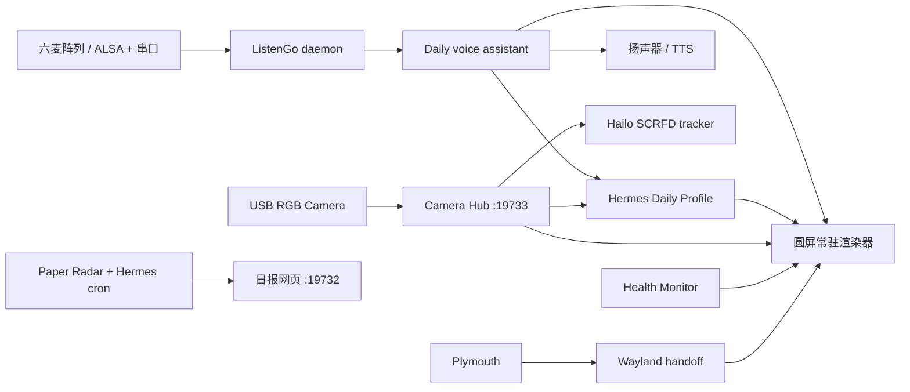

# RiverBank Edge

RiverBank Edge 是一套在 Raspberry Pi 5 上运行的边缘智能助理工程。它把圆形触摸屏、摄像头共享、Hailo-8 本地视觉、六麦阵列、Hermes Agent、语音交互、表情系统、论文日报与健康守护整合为一套可开机自启、可扩展的服务架构。

本仓库来自一台真实运行设备的当前实现，但已经做过公开发布清理：不包含 API Key、Hermes 私人 Profile、数据库、日志、相册、录音、模型权重、第三方表情包、专有字体或 VPN 登录数据。

## 当前能力

- 800×800 圆形 DSI 屏常驻渲染：表情、触摸、环形菜单、状态胶囊、音量、重启确认、相机、相册和屏保。
- 连贯开机画面：Plymouth Logo → Wayland 接力层 → 3×3 方块自检动画 → 表情待机。
- 单实例摄像头中枢：摄像头只由 `ustreamer` 持有，圆屏、Hermes 和 Hailo 从本地 HTTP 流共享画面。
- Daily 语音链路：硬件唤醒、VAD 录音、Faster-Whisper 本地转写、Hermes Daily Profile、Edge TTS 播放与多轮补充。
- 视觉路由：普通对话使用 Hermes 默认模型；明确的看图请求获取当前帧，并由 Hermes Profile 中配置的视觉模型处理。
- Hailo-8 人脸追踪：SCRFD 推理结果写入本地运行时状态，后续可接双轴云台闭环。
- 具身智讯日报：多检索流、半年去重回填、中文候选摘要、全文精读、潜在方法、产业动态与一次性“明日焦点”。
- 可扩展健康守护：systemd、HTTP、JSON、端口、挂载点、文件新鲜度和自定义命令检查。

## 系统关系



核心设计原则是“硬件单一持有、能力按需消费”：常驻相机服务只维持设备和本地流；只有圆屏相机模式、视觉问答或未来的人脸追踪任务才算主动使用摄像头。

## 仓库结构

```text
apps/
  expression-ui/     圆屏、表情、相机/相册、语音协调与 Hermes 表情桥
  face-tracker/      Hailo-8 SCRFD 常驻人脸追踪
  health-monitor/    可扩展自检与桌面告警
  listengo-mic/      麦克风阵列控制口、唤醒与声源方向服务
  paper-radar/       论文采集、Hermes 编辑规则、渲染和网页
config/
  systemd/           可参数化的服务单元；optional/ 为代理和专有 VPN 示例
  plymouth/          开机主题
  labwc/             圆屏窗口与触摸映射参考配置
  lightdm/           VT 复用配置
  panel/             去除启动气泡后的面板参考配置
  udev/              USB 摄像头电源策略
docs/                架构、硬件、部署、维护与发布说明
scripts/             配置渲染、安装和发布检查工具
```

## 快速开始

1. 阅读 [硬件与第三方依赖](docs/HARDWARE.zh-CN.md)。Hermes、HailoRT、Hailo 示例仓库、HEF 权重和表情素材不在本仓库中。
2. 在树莓派上克隆仓库，并生成适配本机的配置：

   ```bash
   python3 scripts/render_config.py \
     --user "$USER" \
     --data-dir /mnt/riverbank-data \
     --hailo-venv /mnt/riverbank-data/ai/apps/hailo-rpi5-examples/venv_hailo_rpi_examples
   ```

3. 查看 `build/generated/manifest.json` 和渲染后的配置；确认输出名、串口、摄像头 USB ID、数据盘和 Hailo 路径。
4. 按 [部署说明](docs/DEPLOYMENT.zh-CN.md) 安装依赖与服务。安装脚本只有显式传入 `--apply` 才会写入系统目录。
5. 运行 `scripts/validate-release.sh` 做源码语法、JSON 与敏感信息检查。

## 默认端口

| 服务 | 地址 | 说明 |
|---|---|---|
| Paper Radar | `0.0.0.0:19732` | 日报网页和“明日焦点”接口 |
| Camera Hub | `127.0.0.1:19733` | 本机共享画面，不默认对外暴露 |
| 可选本地代理 | `127.0.0.1:15732` | 只在启用 optional/proxy 时使用 |

外部访问建议使用 Tailscale ACL 或带认证的 HTTPS 反向代理，不建议路由器直接做公网端口映射。

## 公开发布前

仓库所有者仍需选择源码许可证。若希望宽松开源且重视明确的专利授权，通常可考虑 Apache-2.0；若希望文本更短，可考虑 MIT。请根据公司和贡献者权属自行决定，详见 [发布清单](docs/PUBLISHING.zh-CN.md)。RiverBank 名称与 Logo 的商标/品牌使用应与源码许可证分开处理。
