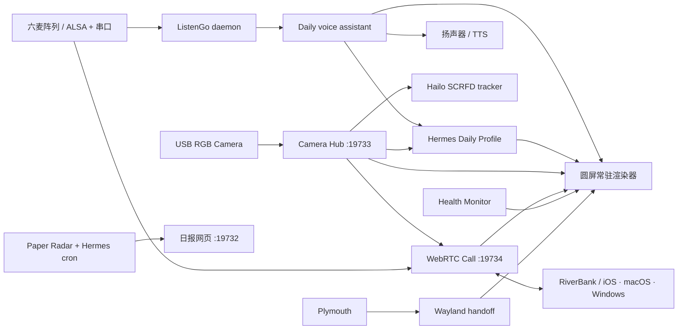

# RiverBank Edge

RiverBank Edge 是一套在 Raspberry Pi 5 上运行的边缘智能助理工程。它把圆形触摸屏、摄像头共享、Hailo-8 本地视觉、六麦阵列、Hermes Agent、语音交互、表情系统、论文日报与健康守护整合为一套可开机自启、可扩展的服务架构。

本仓库来自一台真实运行设备的当前实现，但已经做过公开发布清理：不包含 API Key、Hermes 私人 Profile、数据库、日志、相册、录音、模型权重、第三方表情包、专有字体或 VPN 登录数据。

## 当前能力

- 800×800 圆形 DSI 屏常驻渲染：表情、触摸、两级环形应用菜单、一级菜单圆心的不可交互 24 小时制当前时间、向外续滑固定应用的主菜单槽、状态胶囊、设置页、番茄钟、音量、重启确认、相机、相册和屏保；所有二级应用的按钮返回与手势返回统一回到二级菜单。
- 圆屏番茄钟：默认 25 分钟专注、5 分钟短休、每 4 轮 15 分钟长休；专注、短休和长休在待开始或暂停时都可长按右上角秒表表冠，展开 72 条高密度环形刻度并沿圆周设置当前阶段的一次性 1–180 分钟时长，每 1 分钟吸附一次，休息调时使用叶片绿色主题且不会切回专注或改写默认 5/15 分钟；手指附近的刻度按余弦曲线连续伸长形成刻度波；支持暂停、重置、跳过、后台继续和服务重启恢复；专注自然结束时以番茄红、休息自然结束时以叶片绿完成五次黑色→完成色→黑色的 smoothstep 渐变脉冲，整段约 4 秒，计时圆环、主按钮和调时表冠随颜色平滑反转为黑色，并使用双画面预渲染与逐帧透明度混合保证高帧率；统计中的今日环图与近 7 天趋势拆成左右滑动的两页；Daily 可用本地语音快速创建 1–180 分钟的一次性番茄钟并控制界面。
- 圆屏性能监控：应用二级菜单中的“性能”页面以 1 秒周期异步采集 CPU 利用率、温度、频率与负载，内存和 NVMe 占用、默认网卡实时吞吐、Hailo-8 READY/ACTIVE 状态、整机自检计数、DSI 刷新率、渲染进程内存与运行时间；离开页面后停止高频采样，返回按钮和从左向右滑动均可退出；Daily 可用本地语音打开或关闭性能页。
- 圆屏本地音乐播放器：应用二级菜单中的“音乐”页面异步扫描 SSD 的 `/mnt/nvme64/Music` 音乐库，支持 MP3、FLAC、WAV、M4A、AAC、OGG 和 OPUS，提供上一首、低延迟播放/暂停、下一首和播放进度；右上模式按钮在列表循环、单曲循环和乱序播放之间循环切换并持久保存，长按则手动刷新音乐库，进入页面也会自动异步扫描；播放器利用右侧圆屏边缘布置系统音量组件，待机时仅显示一条细弧和当前音量位置点，触摸后平滑展开为可拖动滑轨，松手后自动收回，全部使用高质量抗锯齿；中央默认显示同名图片、目录封面或音频内嵌专辑图，无封面时显示粗体双音符，单击后以交叉渐变切换到屏幕水平轴上的无框同步歌词，上一句、当前句和下一句随时间纵向平滑滚动，再次单击返回封面；歌曲开始播放、手动切歌或自动续播成功的同时立即自动查找同名 `.lrc`，本地缺失则通过 LRCLIB 在独立后台线程按标题、歌手、专辑和时长搜索同步歌词，匹配结果原子保存到 SSD；不需要打开歌词页，也不设置手动搜索按钮，搜索失败、无网络或限流均不阻塞播放，同一首歌每次服务运行最多联网一次；音乐页“词”按钮独立控制表情主页歌词叠层并持久保存，中央封面/歌词切换不受影响；离开播放器后歌词在表情下方以约 50 px 无框单行显示，宽度按圆屏所在高度的可见弦宽计算，短句居中、长句横向平滑滚动，暂停时滚动冻结；两处歌词的左右边缘均以透明度渐变自然消失；页面退出后继续播放。Daily 可用本地语音打开播放器、播放/暂停、上一首/下一首、切换三种播放模式和控制主页歌词；音乐播放中再次说唤醒词后说“下一首”会直接切歌，不经过大模型。
- 一对一视频通话：应用二级菜单中的“通话”页面与 iOS、macOS 和 Windows 客户端通过 WebRTC 双向传输画面和语音；树莓派端复用 Camera Hub 与 PipeWire 六麦阵列，不直接抢占摄像头或 ALSA；圆屏显示对端画面并可返回或挂断，Daily 可用“打开视频通话”“挂断”等本地语音命令控制。默认同时支持可信局域网和同一 Tailscale tailnet，信令使用配对令牌，媒体使用 DTLS-SRTP，不依赖公网中转服务。
- 连贯开机画面：Plymouth Logo → Wayland 接力层 → 3×3 方块自检动画 → 表情待机。
- 单实例摄像头中枢：摄像头只由 `ustreamer` 持有，圆屏、Hermes 和 Hailo 从本地 HTTP 流共享画面。
- Daily 语音链路：硬件唤醒、VAD 录音、流式字幕、SenseVoice 与 Zipformer CTC 本地最终转写、Hermes Daily Profile、流式 TTS 与多轮补充。
- 回复语义表情：DeepSeek 在最终口语回复中选择受控情绪标签，语音层在朗读前截获标签并同步驱动圆屏表情；标签不会出现在语音或用户可见文字中。
- 视觉路由：普通对话使用 Hermes 默认模型；明确的看图请求获取当前帧，并由 Hermes Profile 中配置的视觉模型处理。
- Hailo-8 人脸追踪：SCRFD 模型常驻、推理按 TTL 租约启停，结果写入本地运行时状态，后续可接双轴云台闭环。
- 正式运行架构：语音表情使用带顺序校验的结构化事件；整机版本采用 `vMAJOR.MINOR.PATCH beta|stable`，并可用 SHA-256 清单检测发布漂移。
- 具身智讯日报：多检索流、半年去重回填、中文候选摘要、全文精读、潜在方法、产业动态与一次性“明日焦点”。
- 可扩展健康守护：systemd、HTTP、JSON、端口、挂载点、文件新鲜度和自定义命令检查。

## 系统关系



核心设计原则是“硬件单一持有、能力按需消费”：常驻相机服务只维持设备和本地流；只有圆屏相机模式、视觉问答或未来的人脸追踪任务才算主动使用摄像头。

## 仓库结构

```text
apps/
  expression-ui/     圆屏、表情、相机/相册、语音协调与 Hermes 表情桥
  face-tracker/      Hailo-8 SCRFD 常驻人脸追踪
  health-monitor/    可扩展自检与桌面告警
  listengo-mic/      麦克风阵列控制口、唤醒与声源方向服务
  paper-radar/       论文采集、Hermes 编辑规则、渲染和网页
  release-manager/   整机版本封存与发布完整性验证
  video-call/        树莓派 WebRTC 端点、圆屏控制和 macOS/Windows 桌面客户端
  ios/               SwiftUI iPhone 客户端：视频通话、后台任务与报告
config/
  systemd/           可参数化的服务单元；optional/ 为代理和专有 VPN 示例
  plymouth/          开机主题
  labwc/             圆屏窗口与触摸映射参考配置
  lightdm/           VT 复用配置
  panel/             去除启动气泡后的面板参考配置
  udev/              USB 摄像头电源策略
docs/                架构、硬件、部署、维护与发布说明
scripts/             配置渲染、安装和发布检查工具
```

## 快速开始

1. 阅读 [硬件与第三方依赖](docs/HARDWARE.zh-CN.md)。Hermes、HailoRT、Hailo 示例仓库、HEF 权重和表情素材不在本仓库中。
2. 在树莓派上克隆仓库，并生成适配本机的配置：

   ```bash
   python3 scripts/render_config.py \
     --user "$USER" \
     --data-dir /mnt/riverbank-data \
     --hailo-venv /mnt/riverbank-data/ai/apps/hailo-rpi5-examples/venv_hailo_rpi_examples
   ```

3. 查看 `build/generated/manifest.json` 和渲染后的配置；确认输出名、串口、摄像头 USB ID、数据盘和 Hailo 路径。
4. 按 [部署说明](docs/DEPLOYMENT.zh-CN.md) 安装依赖与服务。安装脚本只有显式传入 `--apply` 才会写入系统目录。
5. 运行 `scripts/validate-release.sh` 做源码语法、JSON 与敏感信息检查。

## 默认端口

| 服务 | 地址 | 说明 |
|---|---|---|
| Paper Radar | `0.0.0.0:19732` | 日报网页和“明日焦点”接口 |
| Camera Hub | `127.0.0.1:19733` | 本机共享画面，不默认对外暴露 |
| RiverBank Call | `0.0.0.0:19734` | 带配对令牌的局域网/Tailscale WebRTC 信令 |
| 可选本地代理 | `127.0.0.1:15732` | 只在启用 optional/proxy 时使用 |

外部访问建议使用 Tailscale ACL 或带认证的 HTTPS 反向代理，不建议路由器直接做公网端口映射。

## 客户端源码与构建产物

- iOS 源码和可再生成的 Xcode 工程位于 `apps/ios/RiverBankMobile/`；
- macOS 与 Windows 共用 Electron 源码，位于历史命名的 `apps/video-call/windows-client/`；该目录并不表示只支持 Windows；
- macOS 的 DMG/ZIP、Windows 的 EXE，以及 iOS 的 APP/IPA 都属于本机构建产物，不提交到 Git；
- `dist/`、`DerivedData/`、`*.ipa`、`*.xcarchive` 和签名描述文件已加入忽略规则。发布二进制时应通过独立 Release 附件提供，并附带版本号与 SHA-256，而不是把安装包直接放进源码历史。

## 许可证

源码采用 [Apache License 2.0](LICENSE) 开源。RiverBank 名称、公司名称与 Logo 等品牌资产不因源码许可证而开放一般使用，详见 [许可证与品牌说明](LICENSE-NOTICE.md)。
